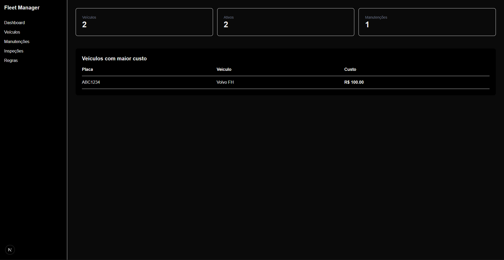
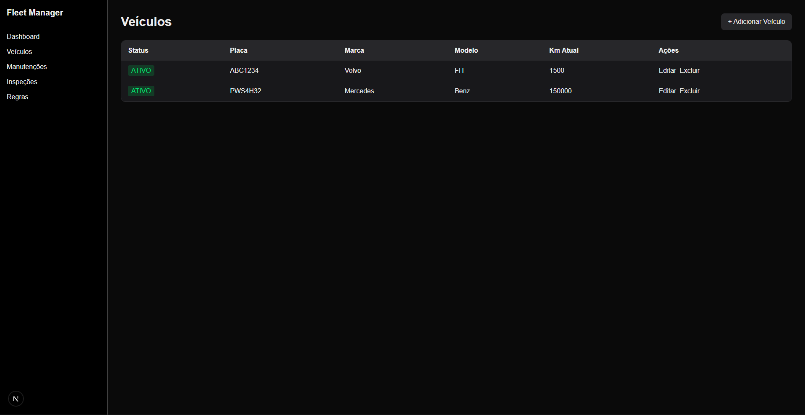

<h1 align="center">
  Fleet Management ERP
</h1>

<div align="center">
  
</div>

ERP/MVP para gestão de frotas desenvolvido com Next.js, FastAPI, PostgreSQL e Docker.

## Arquitetura

Frontend:
- Next.js 15
- TypeScript
- Tailwind
- React Hook Form
- Zod

Backend:
- FastAPI
- SQLAlchemy

Banco de Dados:
- PostgreSQL

Infraestrutura:
- Docker Compose

## Funcionalidades

### Dashboard
- [x] Resumo geral da frota
- [x] Indicadores principais

### Veículos
- [x] Listagem
- [x] Cadastro
- [x] Edição
- [x] Exclusão

## Próximas funcionalidades

- [ ] Gestão de Manutenções
- [ ] Gestão de Quilometragem
- [ ] Gestão de Inspeções
- [ ] TanStack Query
- [ ] Zustand
- [ ] Testes automatizados
- [ ] CI/CD

## Aprendizados

Durante o desenvolvimento foi necessário lidar com:

- Server Components vs Client Components no Next.js
- Comunicação frontend/backend em ambiente Docker
- Configuração de CORS no FastAPI
- Tipagem compartilhada com TypeScript
- Validação de formulários com React Hook Form e Zod
- Relacionamentos e constraints do PostgreSQL

### Exclusão de veículos com dependências

Atualmente não é possível excluir veículos que possuem registros relacionados em outras entidades do sistema (ex.: manutenções).

O PostgreSQL bloqueia a operação para preservar a integridade referencial através das Foreign Keys.

Possíveis soluções futuras:

- Soft Delete
- Cascade Delete
- Fluxo de arquivamento de registros

<h1 align="center">
  Veículos
</h1>

<div align="center">
  
</div>

### 📦 Como rodar o projeto localmente

1. **Clone o repositório:**
```bash
git clone https://github.com/Rinkashi17/Frotas.git
cd Frotas
```

2. **Como executar**

```bash
docker compose up --build
```

Frontend:
http://localhost:3000

Backend:
http://localhost:8000

Swagger:
http://localhost:8000/docs

👤 Autor
Marcos Alessandro (Rinkashi17)

LinkedIn: https://www.linkedin.com/in/rinkashi/

Foco: Desenvolvimento Full Stack | Next | React | TypeScript | FastAPI | Tailwind
